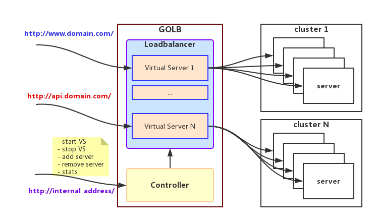

# Go LB

Yet another load balancer

## Features

- [roundrobin](roundrobin/): smooth weighted roundrobin method
- [chash](chash/): cosistent hashing method
- [balancer](balancer/): **multiple LB instances, passive health check, SSL offloading**
- [controller](controller/): dynamic configuration, **REST API to start/stop/add/remove LB at runtime**
- [service discovery](discovery/): autodiscover backend services with **etcd** or **consul**
- [statistics](stats/): HTTP method/path/code/bytes
- [conf](config/): yaml and json configuration

## Examples

- [Basic configuration and REST API](examples/restapi)
- [SSL offloading](examples/https)
- [Service discovery with etcd](examples/etcd)
- [Service discovery with consul](examples/consul)

## LICENSE

MIT License

Copyright (c) 2018 Larry He
